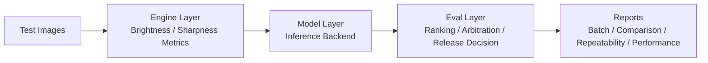

# Agentic Testing Framework: Quantized Vision QA


[](https://github.com/CHDev2116/agentic_testing_framework/actions/workflows/ci.yml)

## 📌 Project Overview
This project is an **automated testing framework** for mobile image-quality validation. It simulates how a **4-bit lightweight model (Quantized Vision Model)** can evaluate image quality in real time under resource-constrained environments such as phones.

The framework follows a **configuration-driven** design, fully decoupling quality thresholds from execution logic so it can quickly adapt to different quantized model standards.

All experiments are reproducible via fixed config profiles and a deterministic preprocessing pipeline.

## 🤖 AI Honesty Statement

Current state:
- **Real**: image metrics are computed from real files (brightness/sharpness).
- **Model inference**: supports `simulated`, `ollama_vision`, `mock_api`, and `llama_cpp` backends (config-driven).

Next integration:
- Connect inference to **Ollama** for live local multimodal inference.
- Optionally connect to a **mock API** for service integration tests.
- Keep the same three-layer architecture so ranking, decision, and benchmarking stay reusable.

## 🛠️ Technical Highlights

### 1. Modular Architecture and Config-Driven Design
* **Fully decoupled**: Uses `configs/*.json` to manage all test standards (sharpness/brightness thresholds), so strategies can be adjusted without code changes.
* **Engine layer**: feature extraction from input images (brightness/sharpness metrics).
* **Model layer**: inference abstraction (rule-based today, real-model adapter-ready).
* **Eval layer**: scoring, ranking, benchmark insights, and release decision.

### 2. Batch Processing and Performance Monitoring
* **Automated pipeline**: Scans the `test_images/` directory automatically, without manually specifying files.
* **Performance tracking**: Built-in **Latency Tracking** records per-image processing time for inference efficiency analysis.
* **Dashboard summary**: Automatically reports **Pass Rate** and **Average Latency** when testing completes.

### 3. Resilience and Error Handling
* **OOM stress simulation**: Includes a random memory-overflow simulator to validate system stability in extreme conditions.
* **Safety-net flow**: Uses `try-except-finally` to ensure the system still produces a context-rich **Crash Report (JSON)** even after failures.

## ✅ Delivery Targets

- **1. Clone repo and run immediately**: if no input images exist, the runner auto-generates sample images.
- **2. Produce comparable results**: run multiple profiles on the same image set and export a comparison report.
- **3. Provide ranking + decision**: every run outputs per-image ranking and a final release decision (`GO` / `REVIEW` / `NO_GO`).
- **4. Keep a clear three-layer architecture**: `engine` (feature extraction), `model` (inference abstraction), `eval` (scoring + decision).

## 🔄 Pipeline Flow (Engine -> Model -> Eval)



## 📂 Directory Structure
```text
agentic_testing_framework/
├── configs/              # Environment-based configs (base/dev/benchmark)
├── src/
│   ├── engine/           # Feature extraction modules
│   ├── models/           # Inference abstraction layer
│   ├── eval/             # Scoring, ranking, and decision logic
│   └── ai_quality_agent.py # Orchestrator for batch flow and reporting
├── test_images/          # Input images for testing
├── results/
│   ├── dev/              # Per-run reports for dev profile
│   ├── benchmark/        # Per-run reports for benchmark profile
│   └── comparisons/      # Cross-profile comparison reports
└── README.md

## 🚀 Usage

Run from the project root:

```bash
# Install dependencies
pip install -r requirements.txt

# (Recommended for contributors) install project with test tooling
python3 -m pip install -e ".[dev]"

# Use the development profile (configs/base.json + configs/dev.json)
python3 src/ai_quality_agent.py --profile dev

# Use the benchmark profile (configs/base.json + configs/benchmark.json)
python3 src/ai_quality_agent.py --profile benchmark

# Load a config file directly (applied on top of configs/base.json)
python3 src/ai_quality_agent.py --config configs/dev.json

# Compare multiple profiles and output a cross-profile ranking
python3 src/ai_quality_agent.py --compare-profiles dev benchmark

# Repeatability test: same image set, run 5 times, report variance
python3 src/ai_quality_agent.py --repeatability-test dev --repeatability-runs 5

# Temporary backend override (without editing config files)
python3 src/ai_quality_agent.py --profile benchmark --inference-backend mock_api

# Optional performance deep-dive (latency vs image size + simple CPU usage)
python3 src/ai_quality_agent.py --profile dev --performance-analysis

# One-command stress benchmark (auto-expand input set to >=100 images)
python3 src/ai_quality_agent.py --profile dev --stress-test-100 --performance-analysis

# Lightweight overhead audit for framework self-cost
python3 src/ai_quality_agent.py --profile dev --overhead-analysis

# Vector retrieval smoke test for failure-memory cases
python3 src/test_failure_memory_retrieval.py
```

Notes:
- `--profile` supports: `dev`, `benchmark`, `base`
- `--config` accepts either an absolute path or a project-root-relative path
- `--compare-profiles` runs each profile and creates `results/comparisons/profile_comparison_*.json`
- `--repeatability-test` runs the same profile repeatedly and writes `results/repeatability/repeatability_*.json`
- `--inference-backend` overrides backend at runtime (`simulated`, `ollama_vision`, `mock_api`, `llama_cpp`)
- `--performance-analysis` writes `results/performance/performance_*.json` with latency-size and CPU summaries
- `--stress-test-100` auto-generates synthetic image variants to reach at least 100 images for stable trend analysis
- `--overhead-analysis` writes `results/overhead/overhead_*.json` to quantify framework self-overhead vs model latency
- `REVIEW` / `NO_GO` samples are persisted to a local ChromaDB (`results/failure_memory_db`) with multilingual sentence embeddings
- Guardrail-driven closed loop is enabled for `NO_GO` recovery: `under-exposed` (brighten), `over-exposed` (dim), and `blurry` (sharpen), bounded by `runtime.max_retry` (default `3`)
- Loopback guardrails include engine/model agreement checks, oscillation detection, near-over/under exposure cutoffs, and minimum brightness/sharpness gain thresholds
- Performance report includes peak process CPU/memory, tail latency (P95/P99), a correlation matrix, and auto-generated scaling insights
- Reports are auto-cleaned when older than 14 days

### 🚨 Automated Error Reporting

- Per-file failures in batch processing automatically generate `error_report_*.json`.
- Fatal pipeline exceptions are also captured into an error report before re-raising.
- Error reports include timestamp, scope, profile, config source, error type/message, and traceback.
- Error reports are saved under the configured `folders.logs` path and auto-cleaned after 14 days.

### 🔌 Real Inference Backends

Inference backend is configured via `model_settings.inference.backend`:
- `simulated` (default): rule-based inference.
- `ollama_vision`: live inference through local Ollama endpoint.
- `mock_api`: external API endpoint for integration testing.
- `llama_cpp`: local OpenAI-compatible endpoint served by `llama-server`.

Example backend config:

```json
"model_settings": {
  "inference": {
    "backend": "ollama_vision",
    "fallback_to_simulated": true,
    "ollama": {
      "host": "http://localhost:11434",
      "model": "llava:7b",
      "timeout_s": 45
    },
    "mock_api": {
      "url": "http://localhost:8080/infer",
      "timeout_s": 10,
      "api_key_env": "MOCK_INFER_API_KEY"
    }
  }
}
```

When backend calls fail, the pipeline can fallback to `simulated` inference if `fallback_to_simulated` is enabled.

### 🦙 llama.cpp Local Server Quickstart

Start `llama-server` (in a separate terminal):

```bash
cd /Users/cheryl/public_repos/Quantization/llama.cpp/build/bin/

./llama-server \
  -m "/Users/cheryl/public_repos/agentic_testing_framework/src/models/llama-3.1-8b-Q4_K_M.gguf" \
  -ngl -1 \
  --port 8080 \
  --chat-template llama3
```

Check server health:

```bash
curl http://127.0.0.1:8080/health
```

Optional connectivity smoke test:

```bash
python3 test_connection.py
```

Run framework with the dev profile (already configured to `llama_cpp`):

```bash
python3 src/ai_quality_agent.py --profile dev
```

## 📤 Output Example

Startup mode: PixelQA-Llama-4bit (4-bit)
Starting to process 3 image(s)...

Processed sample_good.png: [SUCCESS_200] Optimal (4.85ms)
Processed sample_dark.png: [ERR_LIGHT_DARK_002] Under-exposed (4.12ms)

=======================================================
Test Dashboard
  - Total tests: 3
  - Pass rate (Optimal): 66.7%
  - Average latency: 4.66 ms
  - Release decision: REVIEW
-------------------------------------------------------
Top ranking:
  #1 sample_good.png | score=84.2 | Optimal
  #2 sample_bright.png | score=31.6 | Over-exposed
=======================================================

### Typical Performance on M4 Chip

- Throughput: **~6.42 TPS** (measured via local llama.cpp run)
- Typical end-to-end latency in this framework: **~4-9 ms / image** (profile and backend dependent)
- Use `--performance-analysis` for per-run latency/CPU correlation details

## 👉 Benchmark Insights

1) **Trade-off**: stricter quality thresholds improve screening confidence but reduce pass rate.  
   **Observation**: benchmark profile usually keeps similar image ordering but can produce a stricter release outcome.  
   **Decision implication**: use benchmark profile for certification or final quality checks, and dev profile for faster iteration.

2) **Trade-off**: lower latency can hide quality risk if used alone.  
   **Observation**: one profile may be fastest while still returning `REVIEW` or `NO_GO`.  
   **Decision implication**: select profile by combined metrics (`pass_rate` + `avg_latency_ms` + `release_decision`), not speed only.

3) **Trade-off**: ranking is useful prioritization, not a release verdict by itself.  
   **Observation**: top-ranked images can coexist with failed/under-exposed samples in the same run.  
   **Decision implication**: keep `ranking` for debugging and prioritization, and keep `GO/REVIEW/NO_GO` as the final gate.

Project alignment:
- `--compare-profiles` now writes these insights into `results/comparisons/profile_comparison_*.json` under `benchmark_insights`.

## 🔁 Repeatability Example

Command used:

```bash
python3 src/ai_quality_agent.py --repeatability-test dev --repeatability-runs 5
```

Observed output (same image set, 5 runs):
- `same_image_set`: `True`
- `pass_rate_variance`: `0.0`
- `avg_latency_variance`: `0.8026`
- `max_per_image_score_variance`: `0.0`
- `decision_distribution`: `{"REVIEW": 5}`

Interpretation:
- The quality outputs are stable across repeated runs on the same image batch.
- Runtime latency varies slightly by environment/load, while ranking and release decision remain consistent in this run.

Threshold calibration is performed per profile using benchmark feedback to balance pass-rate targets and false-positive risk.
The architecture scales from small local test sets to larger benchmark batches by keeping feature extraction, inference abstraction, and eval logic independently extensible.

## 🗺️ Roadmap

- [x] Profile-based config system and report retention
- [x] Multi-backend inference abstraction (`simulated` / `ollama_vision` / `mock_api` / `llama_cpp`)
- [x] Batch quality ranking + release arbitration (`GO` / `REVIEW` / `NO_GO`)
- [x] Repeatability and benchmark comparison workflows
- [x] Automated JSON error reporting with retention cleanup
- [ ] Multi-threading optimization for larger datasets
- [ ] Extended visual analytics (OpenCV-based color/noise diagnostics)

## 🧪 Evaluation Validity

**Goal:** make release decisions trustworthy, not just repeatable.

**How validity is measured**
- Attach ground-truth labels to test images (e.g., `Optimal`, `Under-exposed`).
- Compute core classification metrics:
  - Precision / Recall
  - False Positive Rate (FPR)
  - False Negative Rate (FNR)

**Why this matters**
- Calibrate thresholds using real error distribution.
- Expose decision bias (too strict vs too permissive).
- Improve both model behavior and eval logic over time.

**Production policy**
- False positives (bad images passing) are treated as higher risk than false negatives.
- Thresholds are tuned conservatively to reduce false acceptances.

**Repeatability vs robustness**
- Repeatability validates stability under identical input.
- Robustness requires diverse benchmark distributions (low-light, motion blur, high noise).

**Performance validity extension**
- Add tail-latency metrics (`P95` / `P99`) to capture worst-case behavior under load.

**Scalability path**
- Parallel batch execution (multi-threading / multi-processing)
- I/O optimization for large image sets
- Backend concurrency control for inference endpoints

This allows the framework to scale from local validation to large benchmark workloads.

## ⚖️ Bias & Decision Reliability

**Key question:**  
How do we ensure the system is not biased or systematically wrong?

### Sources of Bias

1. **Threshold Bias**
   - Fixed brightness/sharpness thresholds may not generalize across datasets
   - Example: low-light scenes vs artistic dark images

2. **Model Bias**
   - Quantized or lightweight models may misinterpret edge cases
   - Example: blur mistaken as under-exposure

3. **Dataset Bias**
   - Evaluation results depend heavily on input distribution
   - Non-representative datasets lead to misleading conclusions

### Detection Strategy

The system detects bias through:

- **Ground-truth comparison**
  - Compare decision outputs against labeled datasets

- **Error distribution analysis**
  - Track:
    - False Positives (FP)
    - False Negatives (FN)

- **Conflict logging**
  - Engine vs Model disagreement is explicitly recorded
  - Stored for offline inspection and dataset improvement

### Mitigation Strategy

1. **Threshold Calibration**
   - Adjust thresholds using benchmark datasets
   - Optimize for acceptable FPR / FNR trade-off

2. **Confidence-aware Arbitration**
   - High-confidence model disagreement overrides borderline metric signals

3. **Dataset Expansion**
   - Include edge cases:
     - low-light
     - blur
     - high noise
     - high contrast

4. **Continuous Feedback Loop**
   - Conflict samples are reused for:
     - config tuning
     - model improvement

### Production Principle

> The system is intentionally **conservative**:
>
> - Prefer false negatives over false positives
> - Avoid passing low-quality images into production

### What This Guarantees

- Decisions are **traceable**
- Errors are **measurable**
- Bias is **detectable and correctable**

This transforms the system from:

> "rule-based evaluation"

into:

> "data-driven decision infrastructure"

## 🎤 Interview TL;DR

- I built a config-driven image QA framework with a clear `Engine -> Model -> Eval` architecture.
- It supports multi-backend inference (`simulated`, `ollama_vision`, `mock_api`, `llama_cpp`) and produces reproducible reports for batch, benchmark, and repeatability analysis.
- I focused on decision reliability by adding arbitration, bias/error tracking, and automated JSON error reporting with retention cleanup.

## 🧪 CI/CD and Coverage

- Workflow: `.github/workflows/ci.yml`
- Stages:
  - `lint`: `ruff check src tests`
  - `unit tests + coverage`: `PYTHONPATH=src pytest` (produces `coverage.xml`)
  - `report generation`: `--performance-analysis --overhead-analysis`
  - `artifact upload`: `coverage.xml` and `results/`

Local run:

```bash
pip install -r requirements.txt
pip install pytest pytest-cov ruff
PYTHONPATH=src pytest
```

## 🎬 Demo Screenshot / GIF

Add demo media files under:

- `assets/demo.gif` (recommended)
- `assets/demo.png`

Then embed with:

```markdown

```

👤 Author
Cheryl - AI Optimization & Testing Engineer