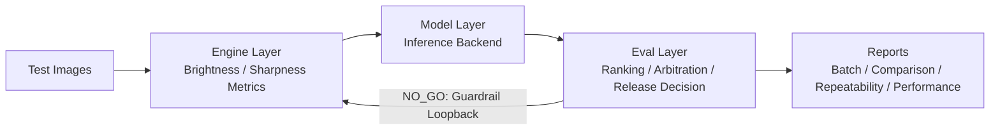

# Agentic Testing Framework: Quantized Vision QA


[](https://github.com/CHDev2116/agentic_testing_framework/actions/workflows/ci.yml)

Configuration-driven framework to evaluate image quality and make production release decisions: `GO` / `REVIEW` / `NO_GO`.

## Demo Preview


If GIF is not available yet, add a screenshot as `assets/demo.png` and switch the path above.

## Why This Project

- Automates repetitive image QA with consistent decision policy.
- Supports multiple inference backends (`simulated`, `ollama_vision`, `mock_api`, `llama_cpp`).
- Keeps results traceable with ranking, reports, and guardrail-driven recovery.

## Quick Start (CLI Pipeline)

```bash
git clone https://github.com/CHDev2116/agentic_testing_framework
cd agentic_testing_framework
pip install -r requirements.txt
python3 src/ai_quality_agent.py --profile dev
```

If no input images are present, sample images are auto-generated.

## Demo UI (Streamlit)

Run the interactive demo:

```bash
streamlit run app.py
```

What the demo shows:
- Upload/sample image + live analysis
- `Mock` vs `Real Pipeline` mode
- Structured output and parsing showcase

Optional media:
- Add `assets/demo.gif` and embed: ``

## Core Guarantees (Source of Truth)

- **Architecture**: `Engine -> Model -> Eval` with clear boundaries.
- **Decision policy**: conservative release gating (`GO` / `REVIEW` / `NO_GO`).
- **Loopback**: `NO_GO` recovery includes brighten/dim/sharpen strategies under retry limits.
- **Retention**: auto-clean for `batch_report_*.json` and `error_report_*.json` after 14 days.
- **CI scope**: lint/test coverage follows `.github/workflows/ci.yml` selected `src` paths plus `tests`.

## Pipeline Flow



## Usage

Basic runs:

```bash
python3 src/ai_quality_agent.py --profile dev
python3 src/ai_quality_agent.py --profile benchmark
python3 src/ai_quality_agent.py --config configs/dev.json
```

Advanced runs:

```bash
python3 src/ai_quality_agent.py --compare-profiles dev benchmark
python3 src/ai_quality_agent.py --repeatability-test dev --repeatability-runs 5
python3 src/ai_quality_agent.py --profile benchmark --inference-backend mock_api
python3 src/ai_quality_agent.py --profile dev --performance-analysis
python3 src/ai_quality_agent.py --profile dev --stress-test-100 --performance-analysis
python3 src/ai_quality_agent.py --profile dev --overhead-analysis
python3 src/test_failure_memory_retrieval.py
```

## Docker (Optional)

```bash
docker build -t pixelqa-llama:latest .
docker run --rm \
  -v "$(pwd)/test_images:/app/test_images" \
  -v "$(pwd)/results:/app/results" \
  pixelqa-llama:latest
```

## Common Issues

- **Ollama not responding**: check `http://localhost:11434`
- **No images found**: samples are auto-generated
- **Slow performance**: try `--inference-backend simulated`

## CI / Tests

```bash
pip install -r requirements.txt
pip install pytest pytest-cov ruff
PYTHONPATH=src pytest
```

Workflow reference: `.github/workflows/ci.yml`

## Deeper Documentation

- Architecture and provider details: [`docs/Architecture.md`](docs/Architecture.md)
- For benchmark, repeatability, and reliability narratives, use docs + report artifacts under `results/`.

## Roadmap

- [x] Multi-backend inference abstraction
- [x] Batch ranking + release arbitration
- [x] Repeatability / performance / overhead analysis
- [x] Automated JSON error reporting with retention
- [ ] Multi-threading optimization for larger datasets
- [ ] Extended visual diagnostics (OpenCV-based)

## Author

Cheryl - AI Optimization & Testing Engineer