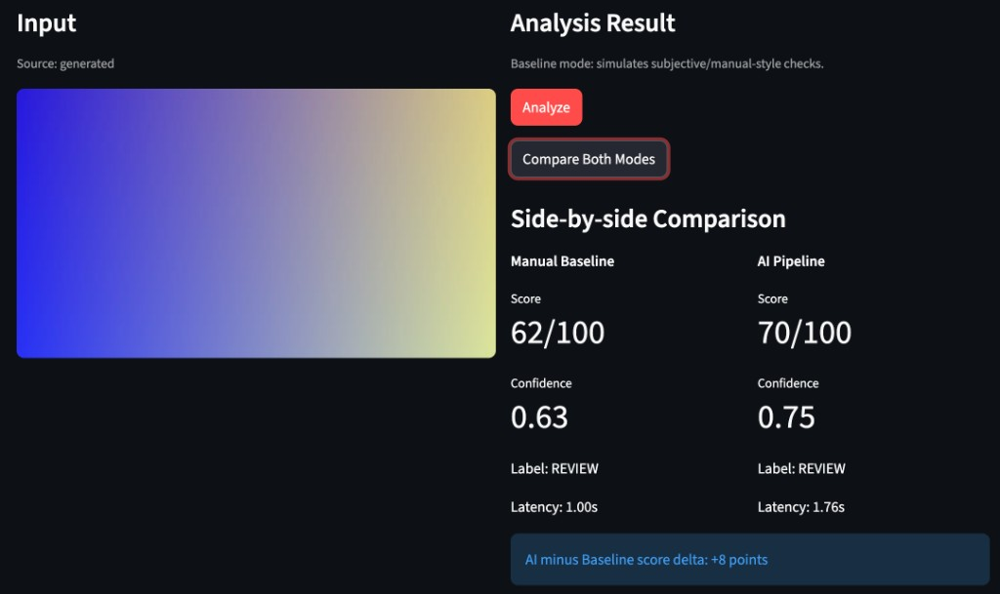
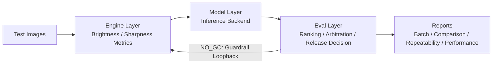

# Agentic Testing Framework


[](https://github.com/CHDev2116/agentic_testing_framework/actions/workflows/ci.yml)

Agentic testing framework for async LLM inference quality checks, regression evaluation, and CI-enforced reliability gates.

CI status: `passing` on `main` with `ruff`, `mypy`, `pytest`, and PR coverage baseline gate checks.

## Quick Start (CLI Pipeline)

```bash
git clone https://github.com/CHDev2116/agentic_testing_framework
cd agentic_testing_framework
python -m pip install -U pip
pip install -e ".[dev]"
python3 src/ai_quality_agent.py --profile dev
```

`requirements.txt` is a thin shim (`-e .[dev]`) for `pip install -r requirements.txt`; **all version pins live in `pyproject.toml`** (`[project.dependencies]`).

If no input images are present, sample images are auto-generated.

<details>
<summary><strong>DX: Built for Extensibility</strong></summary>

This repo optimizes for **integrators**: swap runtimes without rewriting the batch pipeline, keep a **fixed downstream contract**, and emit **auditable JSON** (not “score-only” blobs).

### Config-only inference backend selection

- Set `model_settings.inference.backend` in `configs/*.json` to one of: `simulated`, `ollama_vision`, `mock_api`, `llama_cpp`.
- For ad-hoc runs, the CLI can override without editing files: `python3 src/ai_quality_agent.py --profile dev --inference-backend mock_api` (see `--help`).
- **Connecting a live model** (llama.cpp server or Ollama vision): see [`docs/ModelInferenceSetup.md`](docs/ModelInferenceSetup.md).
- Composition root: `build_inference_engine()` in [`src/models/inference_adapter.py`](src/models/inference_adapter.py) selects the concrete engine class from config.

Same codebase path runs locally (simulated / Ollama / llama.cpp HTTP) or against a mock HTTP API—**no forked “deploy-only” branch** unless your infra truly requires it.

### Orchestrator contract: one method shape, typed-normalized outputs

Engines are **not** tied to a shared ABC in this codebase. Each backend class implements the same surface:

`predict_quality(photo_path: str, metrics: dict) -> dict`

Raw backend responses are validated through `InferenceOutput` (`src/models/contracts.py`) and normalized before use, so downstream code sees a **stable schema**: at minimum `decision`, `code`, `msg`, plus optional `confidence`, and `backend` (including `provider->simulated` when fallback fires).

**Adding a new backend** today means: implement that method + normalize through `InferenceOutput.from_payload(...)`, then add a branch in `build_inference_engine`. If you want static enforcement later, a `typing.Protocol` (or an ABC) is an incremental hardening step—the factory stays the single registry for CI/review friendliness.

### Actionable batch artifacts

- Per-inference payloads retain **`code`** (machine-oriented) and **`msg`** (human-oriented) after normalization—failures are classified, not opaque.
- Batch summaries include **`summary.decision_reason`**: a single string that records how **quality-gate** and **aggregated arbitration** were merged (`merge_gate_and_arbitration`), so **why** the merged outcome is `GO` / `REVIEW` / `NO_GO` is reproducible from the JSON without re-running the batch.
- Per-image rows now include **`inference_output`** (typed trace) with step-level planner history (`steps`) and fallback visibility (`fallback_used`).

Example (trimmed):

```json
{
  "file": "image4.jpeg",
  "decision": {
    "decision": "Under-exposed",
    "code": "ERR_LIGHT_DARK_002",
    "msg": "too dark",
    "backend": "llama_cpp"
  },
  "inference_output": {
    "image_path": "test_images/image4.jpeg",
    "final_decision": "NO_GO",
    "error_code": "ERR_LIGHT_DARK_002",
    "error_message": "too dark",
    "total_latency_ms": 9.91,
    "steps": [
      {
        "attempt": 1,
        "signal": "under",
        "action": "brighten",
        "rationale": "under-exposed signal and safe brightness headroom",
        "fallback_used": true,
        "metrics_before": {"avg_brightness": 9.8, "sharpness": 14.2},
        "metrics_after": {"avg_brightness": 12.1, "sharpness": 13.9},
        "latency_ms": 4.7
      }
    ]
  }
}
```

See also: [`docs/Architecture.md`](docs/Architecture.md) for the provider contract and fallback behavior.

</details>

## Demo UI (Streamlit)

From the **repository root** (so `src` is importable as top-level packages):

```bash
PYTHONPATH=src streamlit run app.py
```

The **AI Pipeline** mode imports `agent.orchestrator`; if imports fail, the UI shows a `PYTHONPATH=src` hint. **Manual Baseline** mode works without the orchestrator.

<details>
<summary><strong>Demo preview & optional assets</strong></summary>

Streamlit UI: generated sample input, **Manual Baseline** vs **AI Pipeline** side-by-side (score, confidence, label, latency), and score delta summary.



Optional: add a short screen recording as `assets/demo.gif` and reference it here for motion (e.g. clicking **Analyze** / **Compare Both Modes**).

</details>

<details>
<summary><strong>Project identity</strong></summary>

| Item | Value |
|------|--------|
| **Display name** | Agentic Testing Framework |
| **Python package** (`pyproject.toml`) | `agentic_testing_framework` |
| **Default model profile label** (`configs/*.json` → `model_settings.name`) | `Agentic Testing Framework - Llama 4-bit` |
| **Docker image tag** (example) | `agentic-testing-framework:latest` |
| **Memory profiling** (`src/util/monitor_performance.py`) | Prefer `ATF_MONITOR_MEMORY=1`; legacy alias `PIXELQA_MONITOR_MEMORY` still works |

</details>

<details>
<summary><strong>Why this project</strong></summary>

- Automates repetitive image QA with consistent decision policy.
- Supports multiple inference backends (`simulated`, `ollama_vision`, `mock_api`, `llama_cpp`).
- Keeps results traceable with ranking, reports, and guardrail-driven recovery.

</details>

<details>
<summary><strong>Core guarantees (source of truth)</strong></summary>

- **Architecture**: `Engine -> Model -> Eval` with clear boundaries.
- **Decision policy**: conservative release gating (`GO` / `REVIEW` / `NO_GO`).
- **Loopback**: `NO_GO` recovery runs a planner step (`plan_next_action`) to choose brighten/dim/sharpen/stop under retry limits.
- **Planner mode**: `runtime.loopback_planner.mode` supports `simulated` (default) and `llm` (with automatic fallback to simulated on planner errors).
- **Planner health check**: when planner mode is `llm`, startup runs endpoint health check by default (`require_healthy_on_startup=true`) and fails fast if unreachable. Use `--planner-skip-health-check` only for controlled fallback experiments.
- **Retention**: auto-clean for `batch_report_*.json` and `error_report_*.json` after 14 days.
- **CI scope**: Ruff on `src` + `tests` + `app.py` + `test_connection.py`; **mypy** on `src` then on `app.py` / `test_connection.py` with `MYPYPATH=src`; pytest with coverage (including **`--cov-fail-under=34`**). Tests emphasize the **release decision path** (arbitration, inference result normalization, loopback integration) and **golden checks** for batch ranking, release gates, log stability windows, Pillow-based vision metrics, and OpenCV exposure validation—see `tests/`.

</details>

<details>
<summary><strong>Pipeline flow</strong></summary>



</details>

## Usage

**Basic runs:**

```bash
python3 src/ai_quality_agent.py --profile dev
python3 src/ai_quality_agent.py --profile benchmark
python3 src/ai_quality_agent.py --config configs/dev.json
```

<details>
<summary><strong>Advanced CLI</strong></summary>

```bash
python3 src/ai_quality_agent.py --compare-profiles dev benchmark
python3 src/ai_quality_agent.py --repeatability-test dev --repeatability-runs 5
python3 src/ai_quality_agent.py --profile benchmark --inference-backend mock_api
python3 src/ai_quality_agent.py --profile dev --loopback-planner llm
python3 src/ai_quality_agent.py --profile dev --loopback-planner llm --planner-timeout-s 10 --planner-model local-planner
python3 src/ai_quality_agent.py --profile dev --loopback-planner llm --planner-skip-health-check
python3 src/ai_quality_agent.py --profile dev --performance-analysis
python3 src/ai_quality_agent.py --profile dev --stress-test-100 --performance-analysis
python3 src/ai_quality_agent.py --profile dev --overhead-analysis
python3 src/ai_quality_agent.py --profile dev --parallel-metrics
python3 src/ai_quality_agent.py --profile dev --async-batch --async-concurrency 4
python3 src/ai_quality_agent.py --profile dev --async-batch --async-concurrency 4 --async-per-image-timeout-s 20
python3 src/ai_quality_agent.py --profile dev --async-batch --async-backend-health-timeout-s 1.5
python3 src/ai_quality_agent.py --profile dev --async-batch --loopback-planner llm
python3 src/ai_quality_agent.py --profile dev --async-batch --async-skip-backend-health-check
python3 src/ai_quality_agent.py --profile dev --async-batch --parallel-metrics
python3 src/test_failure_memory_retrieval.py
```

Deterministic replay (planner trace):

```bash
# 1) Record planner steps to JSONL
python3 src/ai_quality_agent.py --profile dev --replay-mode record --replay-file results/replay_trace.jsonl

# 2) Replay with the same inputs (hash mismatch or missing step => hard fail for that image)
python3 src/ai_quality_agent.py --profile dev --replay-mode replay --replay-file results/replay_trace.jsonl
```

Inference JSON contract (self-repair + strict mode):

Default is **off** (`max_json_repair_attempts: 0`) so CI and simulated batches stay deterministic. Enable in config under `model_settings.inference.contract`:

```json
{
  "model_settings": {
    "inference": {
      "backend": "ollama_vision",
      "fallback_to_simulated": true,
      "contract": {
        "max_json_repair_attempts": 2,
        "strict_contract": false,
        "repair_on_empty_dict": true,
        "repair_prompt_suffix": "Return ONLY a single JSON object with keys decision, code, msg."
      }
    }
  }
}
```

Behavior:

- Parse/validate failures trigger up to N extra LLM calls with validation feedback (`contract_validator.py`).
- Success attaches `contract_meta.repair_attempts` on the inference dict.
- After exhausted repair: `ERR_MODEL_RESPONSE_422` + `repair_exhausted` in `msg`; may fall back to `simulated` unless `strict_contract` is true.
- `runtime.replay_mode=replay` disables repair (same as CI replay smoke).

Semantic asserts (P2) run by default via `eval_settings.semantic_asserts_enabled` (default true). Row-level issues appear in `contract.semantic_errors`; batch summary includes `semantic_assert_fail_count` and `review_breakdown.SEMANTIC_ASSERT_MISMATCH` when arbitration input is overridden.

Oracle historical regression (frozen release semantics):

```bash
PYTHONPATH=src pytest tests/test_oracle_regression.py -q
```

Import a row from a past batch report into the oracle corpus:

```bash
PYTHONPATH=src python scripts/append_oracle_case_from_batch.py \
  --batch-report results/dev/batch_report_YYYYMMDD_HHMMSS.json \
  --file your_image.jpg \
  --id hist-NNN-short-name \
  --description "What this incident was"
```

See `tests/regression/README.md` and `docs/RegressionVersioning.md`. Rule-change drift vs committed snapshots:

```bash
python scripts/diff_oracle_semantics.py
python scripts/refresh_oracle_snapshot.py   # after intentional policy change
```

CI posts a **semantic changelog** to the GitHub job summary on every run; PRs also enforce snapshot parity (`scripts/ci_oracle_semantic_summary.sh`).

**JSON repair audit:** when `contract.max_json_repair_attempts > 0`, each row gets `contract_meta.repair_audit` and `unstable_repair` if decision flips across repair rounds. Default `contract.unstable_repair_release: REVIEW` downgrades release for audit. See `docs/RepairAudit.md`, `docs/FailureTaxonomy.md` (triage **IN**).

Replay CI uses stricter KPI thresholds (`.ci/replay_quality_kpi_thresholds.json`: `max_semantic_assert_fail_count=0`).

</details>

<details>
<summary><strong>Docker (optional)</strong></summary>

```bash
docker build -t agentic-testing-framework:latest .
docker run --rm \
  -v "$(pwd)/test_images:/app/test_images" \
  -v "$(pwd)/results:/app/results" \
  agentic-testing-framework:latest
```

</details>

<details>
<summary><strong>Troubleshooting</strong></summary>

- **Ollama not responding**: check `http://localhost:11434`
- **No images found**: samples are auto-generated
- **Slow performance**: try `--inference-backend simulated`

</details>

<details>
<summary><strong>Live KPI baseline (optional, not CI)</strong></summary>

Profile `live_baseline` runs real inference + contract repair + adaptive backoff + LLM judge (Ollama). Requires a local server (`llama.cpp` on `:8080` or Ollama on `:11434`).

```bash
bash scripts/run_live_kpi_baseline.sh
INFERENCE_BACKEND=ollama_vision bash scripts/run_live_kpi_baseline.sh
PROPOSE_THRESHOLDS=1 bash scripts/run_live_kpi_baseline.sh   # tighten .ci/live_quality_kpi_thresholds.json
```

Writes `.ci/live_quality_kpi_baseline.json` and checks loose ceilings with `--warn-only`. See `docs/LiveKPIBaseline.md`.

</details>

<details>
<summary><strong>CI / local tests</strong></summary>

```bash
python -m pip install -U pip
pip install -e ".[dev]"
PYTHONPATH=src pytest tests/test_oracle_regression.py -q
python scripts/check_quality_kpis.py --enforce --thresholds-file .ci/quality_kpi_thresholds.json
bash scripts/dev_prepush_check.sh
```

Or run each check manually:

```bash
ruff check src tests app.py test_connection.py
mypy --explicit-package-bases src
MYPYPATH=src mypy --explicit-package-bases app.py test_connection.py
PYTHONPATH=src pytest
python scripts/check_coverage_baseline.py --coverage-xml coverage.xml --baseline-file .ci/coverage_baseline.txt
```

Docker and other installs use **`pyproject.toml` only** for dependency pins (`pip install .` in the Dockerfile). The `requirements.txt` shim is optional for local workflows.

Workflow reference: `.github/workflows/ci.yml`

</details>

<details>
<summary><strong>Deeper documentation & roadmap</strong></summary>

**Docs**

- Architecture and provider details: [`docs/Architecture.md`](docs/Architecture.md)
- For benchmark, repeatability, and reliability narratives, use docs + report artifacts under `results/`.

**Roadmap (shipped)**

- [x] Multi-backend inference abstraction
- [x] Batch ranking + release arbitration
- [x] Repeatability / performance / overhead analysis
- [x] Automated JSON error reporting with retention
- [x] Deterministic replay (JSONL planner trace + CI smoke)
- [x] Contract hardening (JSON repair, semantic asserts, oracle regression)
- [x] Adaptive backoff module for async HTTP (config-gated, see `docs/AdaptiveBackoff.md`)

**Backlog (intentionally deferred)**

- **Multi-threading for very large batches**: not on the near-term roadmap so batch runs stay **single-threaded and easier to reproduce** in CI, benchmarks, and incident debugging. Revisit only after profiling shows preprocessing (not inference I/O) as the clear bottleneck.
- **Extended OpenCV visual diagnostics**: basic histogram-based exposure checks already live in `engine/image_validator.py`; richer diagnostics (e.g. saliency, segmentation-assisted QA) stay **out of scope** until there is a concrete partner or product requirement, to avoid scope creep ahead of a stable inference contract.

**Future roadmap (agentic testing hardening)**

- **LLM judge on REVIEW rows (P2.1)** — shipped (simulated, cost-capped); enable via `eval_settings.llm_judge.enabled`.
- **Critique Agent** — outline in `docs/CritiqueAgent.md` (assertion strength / schema coverage recommendations, not a CI gate).
- **Schema-driven auto assertion generation**  
  Priority: **P2** | Effort: **L** | Impact: **High**  
  Use observed response samples and Pydantic contracts to infer boundary/type assertions and scaffold `tests/test_generated_*.py` candidates, reducing manual test-authoring overhead for newly explored paths.

</details>

## Author

Cheryl - AI Optimization & Testing Engineer

## Contributing

See [CONTRIBUTING.md](CONTRIBUTING.md) for local setup, tests, lint, and pull request expectations.

## License

This project is licensed under the [MIT License](LICENSE).
