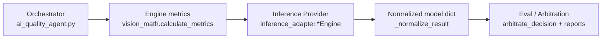

# Architecture: Inference Provider Abstraction (Agentic Testing Framework)

This document explains the **Provider abstraction layer** used by this project: how inference backends are selected, what contract they must satisfy, and how failures are normalized into a stable surface for evaluation and loopback.

In this codebase, **“Provider” = an inference backend implementation** behind a single orchestrator-facing API.

## Goals

- **Swap backends without rewriting the batch pipeline** (`QuantizedVisionAgent` calls one method).
- **Normalize heterogeneous responses** (HTTP JSON, chat completions, rule-based dicts) into one schema.
- **Make failures observable** with stable `decision` / `code` / `msg` (and optional `confidence`).
- **Optional resilience**: remote providers can fall back to `simulated` when configured.

## Design stance: LLM is Agent, not Judge

This project treats LLMs as *agents* (explorers / planners for recovery actions), not as the final authority for pass/fail.
The determinism we need for CI comes from **explicit oracles** (physical metrics + config thresholds + arbitration rules),
while LLM outputs are constrained, normalized, and made observable.

### 1) Determinism vs probabilistic outputs (flaky decision avoidance)

The risk: an LLM can output slightly different JSON, confidence, or rationale across runs, which can create flaky tests.
The mitigation is to keep the final decision grounded in non-LLM signals:

- **Physical metrics are deterministic**: brightness/sharpness computed via `src/engine/vision_math.py`.
- **Decisions are arbitrated by a fixed rule set**: `src/eval/arbitrator.py::arbitrate_decision(...)` combines
  gate metrics (engine) and model verdict (inference result) using a conservative conflict policy.
- **`simulated` is the CI baseline**: providers support `fallback_to_simulated` so CI does not fail due to upstream service variance.
- **Repeatability is measured, not assumed**: `--repeatability-test` records variance across multiple runs and stores a summary report.

Design intent: treat LLM variance as a signal worth *ranking/flagging* (e.g., `REVIEW`) rather than a direct CI gate.

### 2) State control in Observe–Plan–Act loops (runaway loop prevention)

The risk: agentic recovery loops can oscillate or burn tokens without improving the underlying metrics.
This repo implements "loopback hardening" in the image recovery path:

- **Hard retry ceiling**: each image recovery loop is capped by `max_retry` in `src/ai_quality_agent.py`.
- **Progress / gain checks**: retries stop when brightness/sharpness gain is insufficient
  (e.g. `insufficient_brightness_gain`, `insufficient_sharpness_gain`).
- **Oscillation detection**: if the loopback signal flips back (e.g. `under` → `over`), the loop breaks with an explicit stop reason.
- **Planner action constraints**: `src/agent/loopback_planner.py` accepts only a small fixed set of actions (`brighten`, `dim`, `sharpen`, `stop`),
  and it falls back to a deterministic `SimulatedLoopbackPlanner` when the planner output is invalid or errors.

Design intent: make the recovery loop *bounded* and *auditable* by recording step-level traces (`attempt_history`).

### 3) Oracle layering (who defines Ground Truth?)

The risk: if an LLM writes (and "judges") assertions, tests can become superficial `expect(true)` style checks.
This repo avoids that by layering oracles:

- **Ground truth inputs** come from:
  - `vision_math` metrics (deterministic features)
  - `configs/*.json` thresholds and recovery guardrails
- **Judge logic** comes from fixed code:
  - the arbitrator (`src/eval/arbitrator.py`)
  - the merge policy (`merge_gate_and_arbitration`) which defaults to the stricter outcome.
- **LLM output is a contributor, not the oracle**:
  - inference outputs are normalized by `InferenceOutput` (`src/models/contracts.py`)
  - planner rationales are used for traceability, but the *stop/go* decision remains rule-based.

What is still intentionally deferred:
- A "Critique Agent" that scores assertion strength / schema coverage is listed as a roadmap item, not a current gate.
- Deterministic replay (VCR-style) is also roadmap (records planner prompts/responses to eliminate LLM variance).

## Pipeline entry points (two tracks)

**Primary — batch image QA (what the README quick start runs)**

- Entry: `src/ai_quality_agent.py` (CLI) → `QuantizedVisionAgent` → engine metrics (`vision_math`) → `build_inference_engine` → evaluation / arbitration → reports, plus optional **guardrail-driven loopback** on `NO_GO`.

This is the **main production-oriented path** for batch CLI runs (`ai_quality_agent.py`).

**Secondary / demo — staged agent orchestrator**

- Entry: `src/agent/orchestrator.py` → `QualityOrchestrator` (e.g. Gemma-style filter → Llama-style analyst).

This file models a **multi-stage LLM pipeline** for experimentation or future integration. It is **not** connected to the `ai_quality_agent` CLI by default. Readers should treat it as a **reference or second pipeline**, not the sole system entry point, unless you explicitly wire it into the batch runner.

## Where the abstraction lives

- **Factory**: `build_inference_engine(config)` in `src/models/inference_adapter.py`
- **Implementations** (providers):
  - `SimulatedInferenceEngine` (`simulated`)
  - `OllamaVisionInferenceEngine` (`ollama_vision`)
  - `MockAPIInferenceEngine` (`mock_api`)
  - `LlamaCppInferenceEngine` (`llama_cpp`)

Configuration is read from:

- `config["model_settings"]["inference"]["backend"]`
- `config["model_settings"]["inference"][...]` provider-specific blocks (`ollama`, `mock_api`, `llama_cpp`)
- `config["thresholds"]` (passed through to prompts/payloads and simulated rules)

## Provider contract (orchestrator-facing)

Every provider exposes:

```text
predict_quality(photo_path: str, metrics: dict) -> dict
```

### Required output shape (post-normalization)

The orchestrator expects a dict containing at least:

- `decision`: one of the QA labels used downstream (e.g. `Optimal`, `Blurry`, `Under-exposed`, `Over-exposed`, `Error`)
- `code`: stable machine-readable code (e.g. `SUCCESS_200`, `ERR_MODEL_BACKEND_503`)
- `msg`: human-readable explanation
- `backend`: which provider produced the result (may become `ollama_vision->simulated` on fallback)

Optional:

- `confidence`: float in `[0, 1]` when the provider supports it (used by arbitration in some paths)

Normalization is centralized in `_normalize_result(...)`:

```10:28:src/models/inference_adapter.py
def _normalize_result(result: Dict[str, Any], default_msg: str) -> Dict[str, Any]:
    if not isinstance(result, dict):
        return {
            "decision": "Error",
            "code": "ERR_MODEL_RESPONSE_422",
            "msg": default_msg,
        }

    normalized: Dict[str, Any] = {
        "decision": str(result.get("decision", "Error")),
        "code": str(result.get("code", "ERR_MODEL_RESPONSE_422")),
        "msg": str(result.get("msg", default_msg)),
    }
    if result.get("confidence") is not None:
        try:
            normalized["confidence"] = float(result["confidence"])
        except (TypeError, ValueError):
            pass
    return normalized
```

## Factory: selecting a provider

`build_inference_engine` is the **single composition root** for providers:

```299:310:src/models/inference_adapter.py
def build_inference_engine(config: Dict[str, Any]):
    thresholds = config.get("thresholds", {})
    inference_cfg = config.get("model_settings", {}).get("inference", {})
    backend = str(inference_cfg.get("backend", "simulated")).lower()

    if backend == "llama_cpp":
        return LlamaCppInferenceEngine(thresholds=thresholds, inference_cfg=inference_cfg)
    if backend == "ollama_vision":
        return OllamaVisionInferenceEngine(thresholds=thresholds, inference_cfg=inference_cfg)
    if backend == "mock_api":
        return MockAPIInferenceEngine(thresholds=thresholds, inference_cfg=inference_cfg)
    return SimulatedInferenceEngine(thresholds=thresholds)
```

### Design note: explicit registry vs auto-discovery

Today the registry is **explicit if/elif** in the factory. That is intentional for a small, auditable set of backends:

- predictable behavior in CI
- easy security review (no dynamic imports of arbitrary provider modules)

## Provider responsibilities (by category)

### 1) `simulated` (deterministic-ish baseline)

- Wraps `LlamaQuantizer` rule logic.
- Always returns normalized output tagged with `backend=simulated`.

### 2) Remote multimodal / chat providers (`ollama_vision`, `llama_cpp`)

- Build a prompt that includes **metrics + thresholds** (and image bytes as required by the endpoint).
- Parse model text into JSON (best-effort substring extraction when needed).
- Apply timeouts via `requests` `timeout=...`.

### 3) `mock_api` (integration testing)

- POST JSON payload including `photo_path`, `metrics`, `thresholds`.
- Accept either `{ "result": {...} }` or a bare dict body.

## Resilience: fallback policy

Remote providers embed a small resilience pattern:

- construct `SimulatedInferenceEngine(thresholds)` once
- honor `inference_cfg["fallback_to_simulated"]` (default **true** in constructors)
- on failure: return simulated output but annotate:
  - `backend`: `<provider>->simulated`
  - `msg`: includes the exception context

This keeps batch runs **actionable** (you still get a decision object) while preserving observability that the result came from fallback.

## How this connects to the rest of the system

At a high level:



Important: **physical metrics checks** also exist outside the provider layer (engine thresholds + arbitration). Providers should not assume they are the only gate.

## Performance monitoring (`src/util/monitor_performance.py`)

Decorators (`monitor_performance`, `async_monitor_performance`) **always log wall-clock time** (low overhead). **Peak allocation tracking uses Python’s `tracemalloc`**, which adds cost; it is therefore **off by default** so extremely hot paths (very high call rates) are not penalized.

Enable traced memory in logs when profiling:

```bash
export ATF_MONITOR_MEMORY=1
```

Accepted truthy values: `1`, `true`, `yes`, `on` (case-insensitive). Legacy alias `PIXELQA_MONITOR_MEMORY` is still honored. When unset or false, completion logs include elapsed time only.

## Adding a new Provider (checklist)

1. **Add a new class** in `src/models/inference_adapter.py` with:
   - `backend_name = "your_backend"`
   - `predict_quality(self, photo_path, metrics) -> dict`
2. **Normalize** all return paths through `_normalize_result(...)` and set `backend`.
3. **Wire the factory** in `build_inference_engine` with a new `backend` string.
4. **Document config** shape under `model_settings.inference.your_backend` in `configs/*.json` examples.
5. **Add tests**:
   - happy path parsing
   - timeout / HTTP error -> fallback (if applicable)
   - invalid payload -> normalized `Error`

## Related tests

- `tests/test_inference_adapter.py` (normalization behavior)
