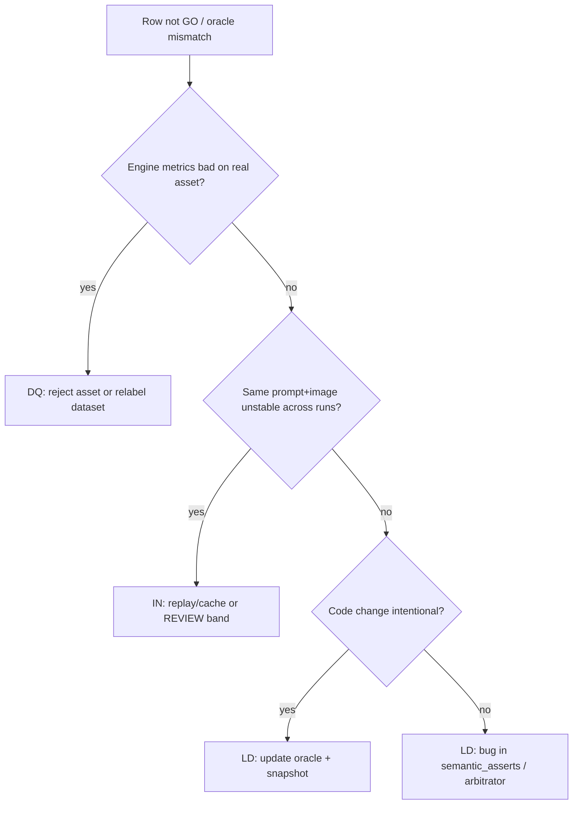

# Failure taxonomy (reject / REVIEW / NO_GO triage)

Use this when a case is **not** a clear GO: decide whether to **fix data**, **update oracle logic**, or **accept inference noise**.

Codes: **DQ** (Data Quality), **LD** (Logic Drift), **IN** (Inference Noise).

---

## Quick decision tree

---

## DQ — Data Quality

**Definition:** The image or capture pipeline is genuinely bad; no model should GO.

| Signals | Examples |
|---------|----------|
| `vision_math` fails consistently | hist-001 dark frame |
| Human QA agrees “unusable” | blur, clipping, lens cap |
| Loopback cannot recover within policy | repeated under-exposed after brighten |

**Action:** Reject asset, fix capture SOP, or move to negative training set. **Do not** weaken oracle to force GO.

**Batch fields:** `engine_metrics`, `decision` aligned with physics, `release=NO_GO`, conflict often `Consistent Fail`.

---

## LD — Logic Drift

**Definition:** Asset is debatable, but **release policy or semantic rules** changed or are wrong.

| Signals | Examples |
|---------|----------|
| Oracle regression fails after **src/** change | semantic policy NO_GO for invalid label |
| `diff_oracle_semantics.py` shows release/conflict drift | intentional policy tightening |
| `expected_*` in jsonl stale vs current code | edited case without updating expectations |

**Action:**

1. Run `python scripts/diff_oracle_semantics.py` for a **semantic changelog**.
2. If intentional: update `oracle_cases.jsonl`, refresh `tests/regression/snapshots/oracle_semantics_v*.json`, document in PR.
3. If unintentional: revert code change.

**Do not** confuse with DQ: metrics OK but label wrong → usually **LD** (schema/semantic), not bad pixels.

---

## IN — Inference Noise

**Definition:** Contract-valid JSON with **non-deterministic** verdict on the same `(image, prompt, backend)`.

| Signals | Examples |
|---------|----------|
| Live batch differs; replay matches | missing replay trace |
| High `fallback_ratio` / repair exhausted | backend flake |
| REVIEW band only on live, not simulated | confidence jitter |

**Action:**

- Prefer **record → replay** (`runtime.replay_mode`) for CI and regression.
- Use **inference result cache** (see `docs/InferenceResultCache.md`) in dev loops.
- Cap cost: `llm_judge`, repair attempts; tag row `IN` in postmortem, not LD.

**Do not** encode flaky live output into `oracle_cases.jsonl` without replay-freezing the inference payload.

---

## Mapping to framework artifacts

| Taxonomy | Primary artifacts |
|----------|-------------------|
| DQ | `engine_metrics`, `vision_math`, loopback `stop_reason` |
| LD | `oracle_cases.jsonl`, `semantic_asserts`, `arbitrator`, semantics **snapshots** |
| IN | `replay_trace.jsonl`, `contract_meta`, `fallback_ratio`, live-only profiles |

---

## The ~20% “reject” band

Not all NO_GO/REVIEW rows share one root cause:

| Bucket | Typical share (indicative) | Owner |
|--------|----------------------------|--------|
| DQ | Assets that should never ship | Capture / dataset |
| LD | Policy and oracle maintenance | Framework maintainers |
| IN | Backend variance | Infra + replay discipline |

Classify new hist-* cases in the jsonl `description` prefix when helpful: `[DQ]`, `[LD]`, `[IN]`.

---

## Related docs

- `tests/regression/README.md` — frozen cases
- `docs/RegressionVersioning.md` — parallel rule-version comparison via snapshots
- `docs/Architecture.md` — arbitrator + semantic policy
