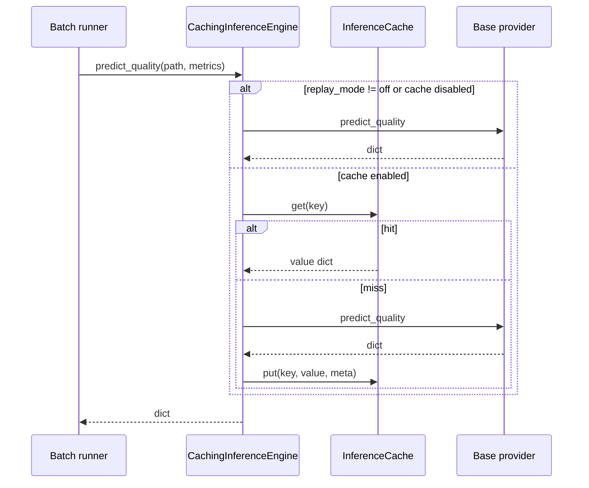

# Inference result cache

**Status:** Shipped (dev accelerator). Not a CI gate.

## Goal

Shorten the local dev loop when re-running the same image corpus against live backends (`ollama_vision`, `llama_cpp`, `mock_api`) without changing release semantics or replay truth.

## Principle

Once a provider returns a **normalized** inference dict, that output is treated as cacheable:

```text
(photo_hash, metrics_hash, backend_id, rules_tag, version_tag) → InferenceOutput dict
```

The cache stores the **post-normalization** inference payload (same shape as `predict_quality()` returns), not raw HTTP bodies. Downstream semantic asserts and arbitration still run on each batch row.

## Where it lives

| Piece | Path |
|-------|------|
| Cache store + wrapper | `src/models/inference_cache.py` |
| Factory integration | `build_inference_engine()` in `src/models/inference_adapter.py` |
| Settings dataclass | `InferenceCacheSettings` |

When enabled, `build_inference_engine()` wraps the concrete backend in `CachingInferenceEngine`, which preserves the same `predict_quality(photo_path, metrics) -> dict` surface.

## Configuration

Add under `runtime.inference_cache` in any profile config (e.g. `configs/dev.json`):

```json
{
  "runtime": {
    "replay_mode": "off",
    "inference_cache": {
      "enabled": true,
      "dir": ".cache/inference"
    }
  }
}
```

| Field | Default | Meaning |
|-------|---------|---------|
| `enabled` | `false` | Turn cache on for this profile |
| `dir` | `.cache/inference` | Directory for cache entry files |

Internal constant (not config-exposed today): `InferenceCacheSettings.version_tag = "v1"`. Bump in code when the on-disk entry schema changes.

## Bypass rules

Cache is **never** used when:

| Condition | Reason |
|-----------|--------|
| `runtime.inference_cache.enabled == false` | Explicitly off |
| `runtime.replay_mode != "off"` | Replay / record is authoritative |
| Key build fails (missing file, I/O error) | Best-effort; inference continues uncached |
| `get` / `put` fails | Best-effort; inference continues |

## Cache key derivation

Final cache key is SHA-256 over a pipe-delimited string:

```text
sha256("{version_tag}|{backend_id}|{rules_tag}|{photo_hash}|{metrics_hash}")
```

### Key parts

| Part | Derivation |
|------|------------|
| `version_tag` | `InferenceCacheSettings.version_tag` (currently `"v1"`) |
| `backend_id` | `"{backend}\|{sha256(provider_cfg)}"` where `provider_cfg` is the backend-specific block (`ollama`, `llama_cpp`, or `mock_api`) |
| `rules_tag` | `sha256({ thresholds, contract settings })` — see below |
| `photo_hash` | SHA-256 of image file bytes (`sha256_file`) |
| `metrics_hash` | SHA-256 of stable JSON for the metrics dict (`stable_json_sha256`) |

### `rules_tag` payload

```json
{
  "thresholds": { "...": "from config thresholds" },
  "contract": {
    "max_json_repair_attempts": 0,
    "strict_contract": false,
    "repair_on_empty_dict": true,
    "repair_prompt_suffix": "...",
    "replay_mode": "off"
  }
}
```

Changing thresholds or contract repair settings invalidates matching entries (new `rules_tag` → cache miss).

## On-disk entry schema

One file per key: `{cache_dir}/{key}.json`

```json
{
  "version": "v1",
  "value": {
    "decision": "Optimal",
    "code": "SUCCESS_200",
    "msg": "Image quality acceptable",
    "backend": "ollama_vision",
    "confidence": 0.92,
    "contract_meta": {
      "repair_attempts": 0
    }
  },
  "meta": {
    "created_at_unix": 1755686400.123,
    "photo_hash": "abc123...",
    "metrics_hash": "def456...",
    "backend_id": "ollama_vision|789...",
    "rules_tag": "012..."
  }
}
```

| Field | Required | Notes |
|-------|----------|-------|
| `version` | yes | Entry schema version (`v1`) |
| `value` | yes | Normalized inference dict returned to the pipeline |
| `meta.created_at_unix` | yes | Unix timestamp at write time |
| `meta.photo_hash` | yes | For debugging / manual invalidation |
| `meta.metrics_hash` | yes | For debugging |
| `meta.backend_id` | yes | For debugging |
| `meta.rules_tag` | yes | For debugging |

Writes use atomic replace (temp file + `os.replace`) to avoid half-written entries.

## Lookup flow



## Interaction with other mechanisms

| Mechanism | Relationship |
|-----------|--------------|
| **Replay JSONL** | Authoritative for CI; cache bypassed when `replay_mode != off` |
| **Oracle regression** | No cache; frozen cases use jsonl inputs |
| **Simulated backend** | Cache can wrap simulated runs; usually low benefit |
| **Live baseline profile** | Prefer cache off when recording real KPIs |
| **Semantic asserts / arbitrator** | Always recompute on batch rows; cache only skips provider HTTP |

## Invalidation

| Event | Action |
|-------|--------|
| Change `thresholds` or `contract.*` | Automatic miss (new `rules_tag`) |
| Change provider config (host, model, prompt) | Automatic miss (new `backend_id`) |
| Change image bytes | Automatic miss (new `photo_hash`) |
| Change metrics passed to provider | Automatic miss (new `metrics_hash`) |
| Bump `version_tag` in code | All prior entries ignored |
| Model weights / server swap | Manually delete `.cache/inference/` |

## Operational notes

- Default directory `.cache/inference` is local-only; add to `.gitignore` if you commit cache dirs by habit.
- Cache is **best-effort**: failures log at DEBUG and never fail the batch.
- Enable only for repeated local iteration; CI and replay smoke stay uncached.

## Related tests

- `tests/test_inference_cache.py` — hit, miss on metrics change, replay bypass

## Non-goals

- Distributed cache (Redis, shared NFS)
- Caching arbitrator or semantic policy outputs
- Caching loopback planner decisions (use replay JSONL instead)
