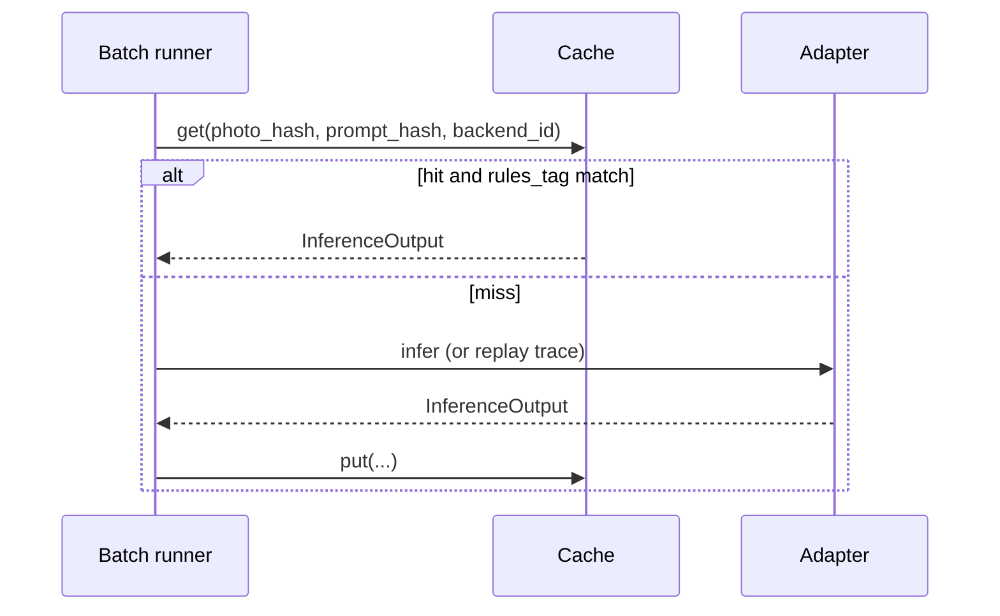

# Inference result cache (design)

## Goal

Keep **single-threaded, replay-first** reproducibility while shortening the dev loop when the corpus grows. Avoid “turn on multithreading” as the first lever.

## Principle

Contract-based inference is a pure function **once the backend response is fixed**:

```
(photo_identity, prompt_identity, backend_id, backend_version) → InferenceOutput
```

Cache the **normalized** `InferenceOutput` dict (post-parse, post-repair), not raw HTTP bodies, so semantic asserts stay tied to the same contract object.

## Key design

| Key part | Suggested derivation |
|----------|----------------------|
| `photo_hash` | SHA-256 of image bytes (or stable `replay_image_key` + content hash in dev) |
| `prompt_hash` | `planner_input_hash()` / hash of vision prompt template + thresholds slice |
| `backend_id` | e.g. `llama_cpp@host:8080`, `simulated`, `ollama_vision:llava:7b` |
| `rules_tag` | Short git SHA of `inference_adapter` + `contract_validator` (invalidate on contract change) |

**Cache value:** JSON serialization of `InferenceOutput.to_dict()` + `contract_meta`.

**Storage:** Local directory (default `.cache/inference/`), gitignored. Optional SQLite for thousands of keys.

## Lookup flow



## Interaction with existing mechanisms

| Mechanism | Role |
|-----------|------|
| **Replay JSONL** | Authoritative for CI; cache is dev accelerator only |
| **Oracle regression** | No cache; in-memory metrics + ai_result from jsonl |
| **Simulated backend** | Trivially cacheable; useful for stress suites |
| **Live baseline profile** | Cache reduces cost; do not use cache for KPI baseline recording |

## Invalidation

- Bump `rules_tag` on contract/schema changes (automatic via git SHA).
- `--no-cache` CLI flag for one-shot live verification.
- Delete `.cache/inference/` when backend model weights change.

## Status

**Not implemented** in runtime (design only). Implement when batch size or live dev latency blocks iteration; prefer replay record for CI truth.

## Non-goals

- Distributed cache / shared Redis (out of scope).
- Caching arbitrator or semantic policy outputs (cheap; always recompute).
